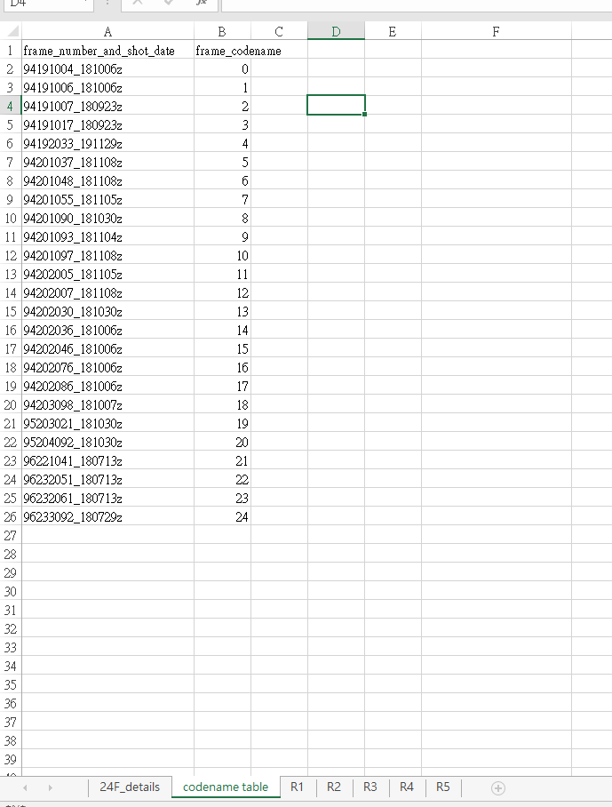
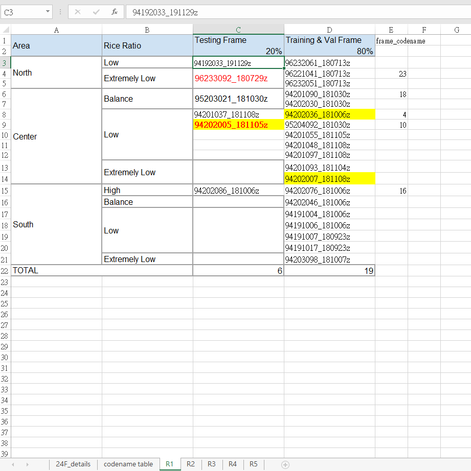
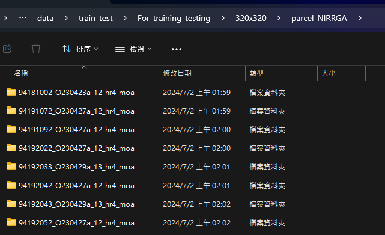
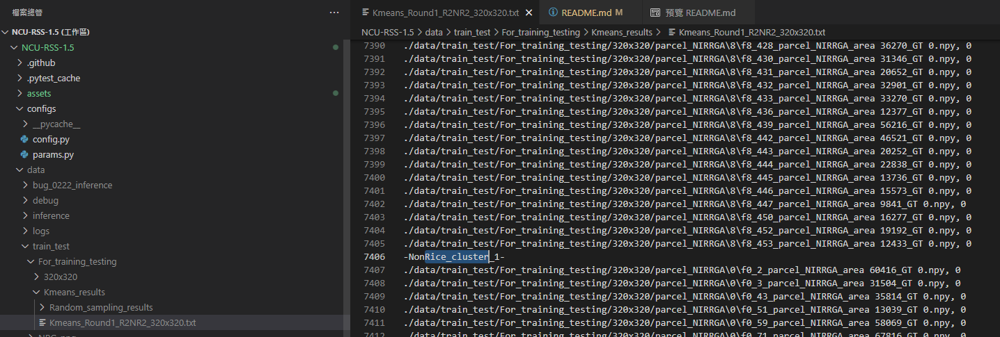
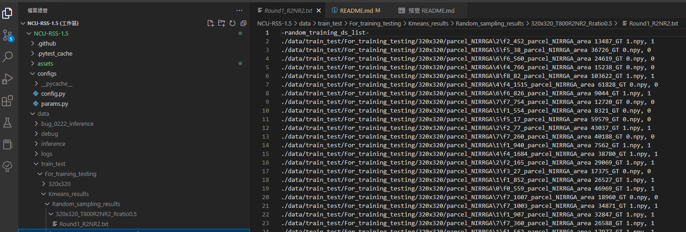
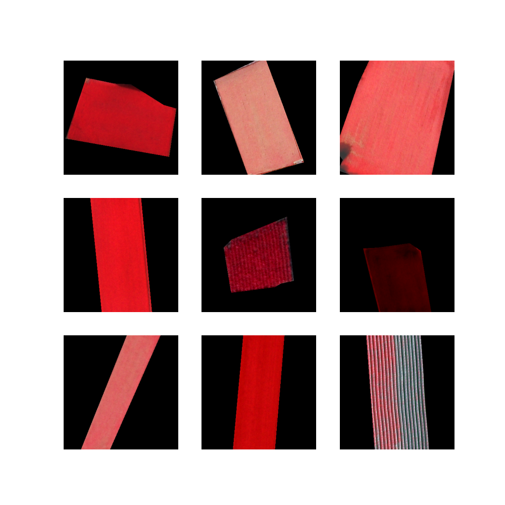
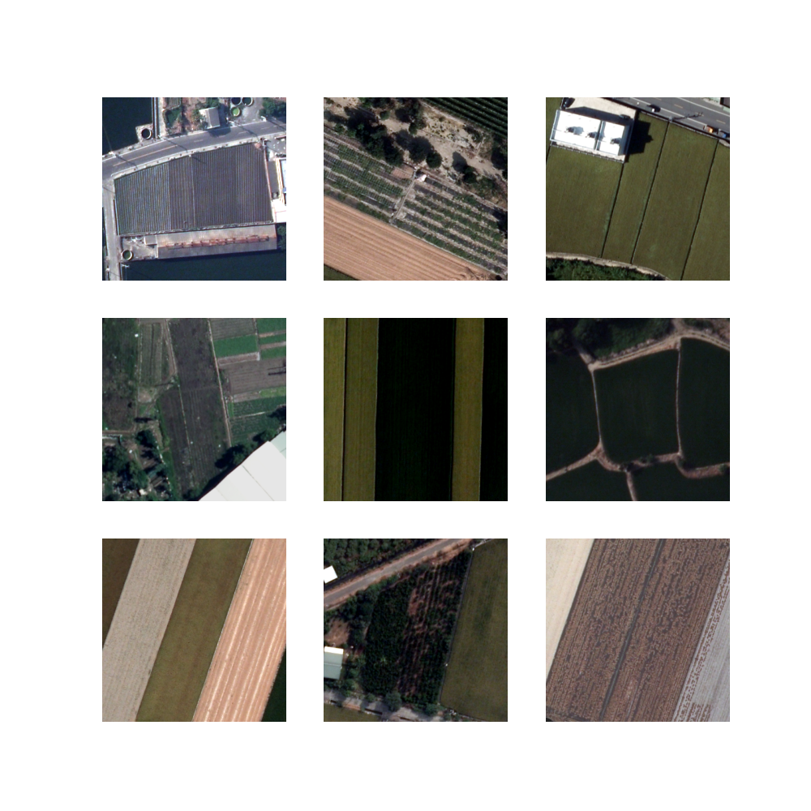
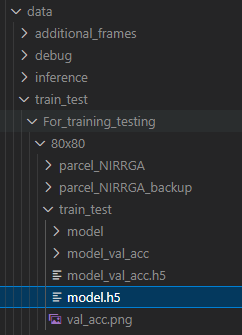
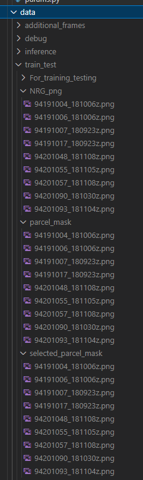

# NCU-RSS-1.5 User Guide
Includes the following:  
- Development scenario
- Production scenario-Training
- Production scenario-Inference
# Install dependencies
```sh
    py -m pip install requirements
```
# Development scenario
This scenario includes training, validation and testing.
## Edit Config.py
Set the appropiate parameters.  
- `train_on_all_frames` should be set false in the development scenario.
- `select_specific_parcels` is used for selecting specific parcels for training. When true, delete parcels that are not selected.
- may also modify the `batch_size`, `EPOCH_N`, `optimizer_learning_rate`, `total_parcel_amount`
- Currently we use 3 channels input NIR-RG bands for the input. however if you want to change the input channels to 4 bands NIR-RGB you can change parameter `data_shape` as shown below
```sh
data_shape = (shape[0], shape[1],4) 
```

## Set up round to frame mapping
- To perform k-fold experiments, we need an excel file `mapping.xlsx` to map the frames used for training/testing to each fold.
- See `sample_mapping.xlsx` for the excel sheet format.
- Edit tabs 'codename table' and 'R1', 'R2', 'R3', 'R4', 'R5'... to fit your use case.  
**Important note**  
The framecodes must correspond to the sorted list of the list of frames.  
That is, with each addition of a frame, the framecodes may have to be reassigned.   
Furthermore, the function content in Rx_testing in parcel_based_CNN.py also have to be updated.  
   
  
- place your custom mapping.xlsx under `./data/train_test`

## Data Preprocessing
This step move parcel dataset based on complete frame aerial image.
After running the NCU-RSS-1.5-preprocessing repository. Follow these steps
1. Place the preprocessing result folder(.npy parcel data and gt .txt) under  
    ```sh
    data\train_test\For_training_testing\320x320\parcel_NIRRGA
    ```
(if you run  `NCU-RSS-1.5-preprocessing` copy from `result`) 


## K-means clustering

```sh
py kmeans_cluster_for_train_test.py
```
The kmeans results are placed here:  

## Random Sampling

```sh
py random_sampling_for_parcel_dataset_for_train_test.py
```
The sampling result are placed here:  

## Train and Validate Model
Do not forget the round number in `config.py` when you want to run cross validation. 
plese change the `MASKING` and `DATA_SHAPE_STR` according ur need. 
Here is the sample of masked input 
Here is the sample of nonmasked input 
Generaly the masked input yield better model performance
```sh
py train_and_val_model.py
```

## Test Model
By default we will not show the predicted mask. If you want to save the predictions, set "save_prediction" to true in config.py.  
And make sure the functions content in Rx_testing in parcel_based_CNN.py match the settings of mapping.xlsx.  
```sh
py test_model.py
```


# Production scenario-Training

## Edit Config.py
Set the appropiate parameters.  
- `train_on_all_frames=True`
- `select_specific_parcels=True`
## Input data
1. Place the GT masks(.png) under  
    ```sh
    data\train_test\parcel_mask
    ```
2. Place the aerial images(.png) under  
    ```sh
    data\train_test\NRG_png
    ```
3. Place the the mask for selected parcels under
    ```sh
    data\train_test\selected_parcel_mask
    ```
    
4.  run script
    ```sh
    py generate_parcel_dataset_for_train_test.py
    ```
## K-means clustering

```sh
py kmeans_cluster_for_train_test.py
```  
The kmeans result are placed here:  

## Random Sampling

```sh
py random_sampling_for_parcel_dataset_for_train_test.py
```
The sampling result are placed here:  

## Train and Validate Model

```sh
py train_and_val_model.py
```
The trained model is saved in `data\train_test\For_training_testing\[H]x[W]\train_test`.  Note that `model.h5` preserves the parameters of the model with highest training acc, while `model_val_acc.h5` preserves the parameters of the model with highest validation acc.

# Production scenario-Inference
## Data Preprocessing
This step move parcel dataset based on complete frame aerial image.
After running the NCU-RSS-1.5-preprocessing repository. Follow these steps
1. Place the preprocessing result folder(.npy parcel data and gt .txt) under  
    ```sh
    data\inference\For_training_testing\320x320\parcel_NIRRGA
    ```
(if you run  `NCU-RSS-1.5-preprocessing` copy from `result`) 

## Inference
```ps
py .\inference.py
```
To start the inference please select the desired model from `data\train_test\For_training_testing\320x320\train_test` to 
The inference results are in the form of .txt prediction, stored under `data\inference\saved_model_and_prediction\model_val_acc`.

The result is the (FID_Label prediction confidence) for each parcel
```
101120003 1 0.995802104473114
101120006 1 0.9508105516433716
101120007 0 0.9442816376686096
101120008 1 0.9918718338012695
...
```

# Running the Test Cases in ./test
<details>

## Requirements
- coverage
- pytest
## PEP-8 Conformance
```powershell
py -m pytest test/code_style_check.py
```
## Test with pytest and obtain coverage
```powershell
py -m coverage run -m --source=src pytest test/
py -m coverage json
py -m pytest test/get_coverage.py
py -m coverage report
```
```powershell
PS D:\1111_work\NCU-RSS-1.5> py -m coverage report
Name                                                                                Stmts   Miss  Cover
-------------------------------------------------------------------------------------------------------
src\__init__.py                                                                         0      0   100%
src\models\__init__.py                                                                  0      0   100%
src\models\driver.py                                                                   25      3    88%
src\models\parcel_based_CNN.py                                                        774    216    72%
src\models\parcel_based_CNN_models.py                                                  95     33    65%
src\preprocessing\__init__.py                                                           0      0   100%
src\preprocessing\generate_parcel_dataset_based_on_complete_frame_aerial_image.py      41      6    85%
src\preprocessing\kmeans_clustering_for_parcel_dataset.py                             129     12    91%
src\preprocessing\parcel_preprocessing.py                                             483    117    76%
src\utils\__init__.py                                                                   0      0   100%
src\utils\config.py                                                                    20     20     0%
src\utils\excel_io.py                                                                  33     27    18%
-------------------------------------------------------------------------------------------------------
TOTAL                                                                                1600    434    73%
```

## Important Notes


1. Do not modify the config until the process end, keep it the same from generating parcel until inference process. Changing the config between phases will resulting an error.
2. If you want to add or reduce the number of frames please modify the mapping.xlxs, and sort it in increment order
</details>