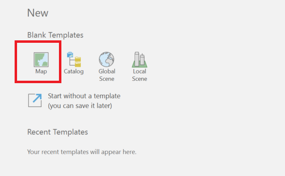
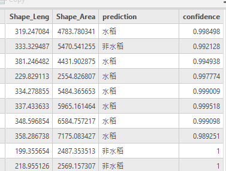

# NCU-RSS-Predict-Postprocessing
This repo writes the segmentation from RSS-1.3 or RSS-1.5 result back into the shp file.

# FAQ
- `file_name = raster_PGW_Path + "/" + imgname[2] + "_" + imgname[3] + ".png"IndexError: list index out of range`
可能是語意分割結果的.png檔位正確命名。
請確保語意分割結果的.png檔案名稱為此格式:`FOLD?_TEST_???????_???????.png`
- invalid workspace
```ps
...
arcgisscripting.ExecuteError: ERROR 000875: Output table: zonalstattblout1's workspace is an invalid output workspace.   
ERROR 000581: Invalid parameters.
Failed to execute (ZonalStatisticsAsTable).
```
check arcpy workspace in config
# Usage
## prepare input data
1. ./PRED folder：put model prediction .txt (`Pred_[frame_id].txt`) to this folder.
2. Put frame's shape file to ./SHP. You can put shape file of multiple frames in the folder.
each .shp contain 8 file：.cpg, .dbf, .prj, .sbn, .sbx, .shp, .shp.xml, .shx
```powershell
PS D:\1111_work\NCU-RSS-Predict-Postprocessing> ls .\SHP\


    目錄: D:\1111_work\NCU-RSS-Predict-Postprocessing\SHP


Mode                 LastWriteTime         Length Name
----                 -------------         ------ ----
-a----        2023/1/3  下午 04:09              5 PD_94201093_181104z_13~0458_hr4.cpg
-a----        2023/1/3  下午 04:09        3455042 PD_94201093_181104z_13~0458_hr4.dbf
-a----        2023/1/3  下午 04:09            399 PD_94201093_181104z_13~0458_hr4.prj
-a----        2023/1/3  下午 04:09          15836 PD_94201093_181104z_13~0458_hr4.sbn
-a----        2023/1/3  下午 04:09           1764 PD_94201093_181104z_13~0458_hr4.sbx
-a----        2023/1/3  下午 04:09         573572 PD_94201093_181104z_13~0458_hr4.shp
-a----        2023/1/3  下午 04:09         124764 PD_94201093_181104z_13~0458_hr4.shp.xml
-a----        2023/1/3  下午 04:09          12132 PD_94201093_181104z_13~0458_hr4.shx
-a----        2023/2/6  上午 11:40              5 PD_94202076_181006z_16~4634_hr4.cpg
-a----        2023/2/6  上午 11:40        5281157 PD_94202076_181006z_16~4634_hr4.dbf
-a----        2023/2/6  上午 11:40            399 PD_94202076_181006z_16~4634_hr4.prj
-a----        2023/2/6  上午 11:40          25588 PD_94202076_181006z_16~4634_hr4.sbn
-a----        2023/2/6  上午 11:40           3108 PD_94202076_181006z_16~4634_hr4.sbx
-a----        2023/2/6  上午 11:40         704504 PD_94202076_181006z_16~4634_hr4.shp
-a----        2023/2/6  上午 11:40         143330 PD_94202076_181006z_16~4634_hr4.shp.xml
-a----        2023/2/6  上午 11:40          18492 PD_94202076_181006z_16~4634_hr4.shx
```
## 建立一個Arcgis Map專案
在Arcgis中建立一個Map新專案(Project)，創立成功可在C:\Users\[使用者名稱] \Documents\ArcGIS\Projects 中看到專案資料夾，此範例專案命名為”PNGOutput”

## 編輯.configs/config.py
- workspace:第三步Arcgis中gdb資料夾路徑，以本範例此路徑為   
`C:\Users\[使用者名稱]\Documents\ArcGIS\Projects\PNGOutput\PNGOutput.gdb`
- Tool_box: 指定Arcgis Toolbox位置，以本範例此路徑為
`C:\program files\arcgis\pro\Resources\ArcToolbox\toolboxes\Conversion Tools.tbx`
- directory: 指定本repo資料夾位置，以本範例此路徑為
`C:\Users\[使用者名稱]\Downloads\NCU-RSS-Predict-Postprocessing`
## run program
```powershell
C:\'Program Files'\ArcGIS\Pro\bin\Python\envs\arcgispro-py3\python.exe ./write_back_pred_to_shp.py
```
## 輸出結果
查看`Prediction_SHP_Result`，包含寫入判釋結果的SHP。  
該shp將包含`confidence`與`prediction`欄位。`prediction`的值可以是`水稻`或`非水稻`。`confidence`的值可以是屬於[0,1]的浮點數，越接近1代表AI的預測信心越高。  
請用arcgis專案開啟該shp檔案觀看結果，如下範例：  


# 工作原理
- we use ZonalStatisticsAsTable to obtain the average values of pixels in a parcel. We use this as the classification confidence.

# grabbing known ood labels
- put shp containing ood labels in ./prediction_shp_result
```txt
C:\'Program Files'\ArcGIS\Pro\bin\Python\envs\arcgispro-py3\python.exe grab_ood_cases.py
py save_ood_cases_2_csv.py
```
# Computing Kappa coefficent based on prediction shp
This script is used for computing kappa by looking into the prediction shps. The prediction shps must have ground truths.  
It also prints the fps and fns of each testing frames, and saves them at `fps_fns\Prediction_94201037_181108z_fps_fns.txt`.
```ps
C:\'Program Files'\ArcGIS\Pro\bin\Python\envs\arcgispro-py3\python.exe ./grab_gt_and_predictions.py
```
```ps
py compute_metrics.py
```
```powershell
PS D:\1111_work\git_repos\NCU-RSS-Predict-Postprocessing> py .\compute_metrics.py
2023-10-15 18:32:54 - root - INFO - frame_name : Prediction_94181012_211117a
2023-10-15 18:32:54 - root - INFO - kappa : 0.035285
2023-10-15 18:32:54 - root - INFO - parcel_based_kappa_with_area_weights : 0.947568
2023-10-15 18:32:54 - root - INFO - accuracy_score : 0.892978
2023-10-15 18:32:54 - root - INFO - f1_score : 0.040609
2023-10-15 18:32:54 - root - INFO - [ 1573 188 1 4]
...
```
The fps and fns.
```txt
pk	label	predict	error_type
NCU_94201037_181108z_17~1371_hr4_0066	0	1	fp
NCU_94201037_181108z_17~1371_hr4_0087	1	0	fn
NCU_94201037_181108z_17~1371_hr4_0090	1	0	fn
NCU_94201037_181108z_17~1371_hr4_0101	1	0	fn
NCU_94201037_181108z_17~1371_hr4_0196	0	1	fp
...
```

