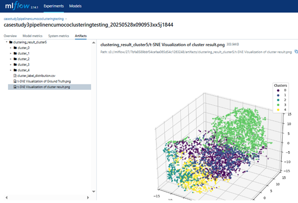

# Traceability Centric MLOps Platform
Enabling Traceability in Cloud-Native Machine Learning Workflows with API-Level Dependencies and  Controller-Based Execution

# Abstract
As machine learning (ML) workflows grow in complexity—spanning heterogeneous environments, toolchains, and execution contexts—the lack of reliable associations between inputs, configurations, and outputs has emerged as a fundamental challenge. Without systematic traceability, workflows become prone to inconsistencies, hindered debugging, collaboration inefficiencies, and increased maintenance overhead. This thesis project focuses on the architectural design and implementation of a modular orchestration framework to systematically enable traceability throughout the ML workflow lifecycle. The system enhances traceability through five integrated dimensions: (1) version-controlled resource management for datasets, code, environments, and models; (2) automated workflow integration via API-based task abstraction; (3) structured input-output association and metadata tracking; (4) centralized task-level logging; and (5) unified runtime component logging. These mechanisms collectively support the systematic recording, correlation, and inspection of workflow execution contexts—thereby enabling consistent and verifiable traceability across all stages of ML workflows in heterogeneous environments.

# System Architecture

we have introduced a variety of tools and technologies essential to modern 
MLOps practices, including workflow orchestration, containerization, observability, version 
control, and storage solutions. While each tool provides specific functionalities, their 
integration in the proposed system is designed to address key challenges in traceability, 
automation, and reproducibility.
Table below summarizes the tools covered in this chapter, describing their roles 
within the proposed system architecture and illustrating how they contribute to each stage of 
the ML workflow.

## System Components Overview

| Tool / Platform | Category                  | Role in the Proposed System |
|------------------|---------------------------|------------------------------|
| **Kubernetes**   | Container Orchestration   | Executes each pipeline task in an isolated Pod or Job with dynamic resource allocation and mounted storage (PVC). Enables sandboxing, scalability, and automation. |
| **Apache Airflow** | Workflow Orchestration | Manages pipeline task dependencies using DAGs. Each task triggers an API call to backend services, decoupling orchestration from execution logic. |
| **Kafka**        | Messaging / Event Bus     | Sends task-level API responses (status, logs) from the backend to Logstash. Enables decoupled, asynchronous communication across components. |
| **ELK Stack**    | Observability             | Captures and visualizes logs through Logstash (from Kafka), Elasticsearch (indexing), and Kibana (UI), allowing real-time monitoring and debugging. |
| **MLflow**       | Experiment Tracking       | Records parameters, metrics, and artifacts for each experiment. Supports model registry and links each version to training metadata for reproducibility. |
| **MinIO**        | Object Storage            | Serves as unified storage for datasets (via DVC), intermediate pipeline outputs, execution logs, and MLflow artifacts. Supports reproducibility and auditability. |
| **Harbor**       | Container Registry        | Hosts all container images used in pipeline tasks and backend services. Ensures versioned, secure, and consistent environment provisioning. |
| **GitHub**       | Code & Data Repository    | Stores version-controlled source code, DVC metafiles, and configuration. Enables reproducible workflows by referencing commit hashes. |
| **GitLab**       | CI/CD & DAG Management    | Manages pipeline templates. Supports automated DAG deployment through CI pipelines triggered by user-defined workflows. |

# Proposed Cloud-Native System Architecture for Traceable ML Workflows
We propose a cloud-native system architecture that enables end-to-end traceability across the lifecycle of machine learning (ML) workflows. This architecture is built on a four-layer modular design, integrating workflow orchestration, resource management, and dynamic service coordination.

At the user level, machine learning pipelines are defined using Airflow's Python-based DAG scripting interface, allowing users to compose reusable and parameterized workflows. Each DAG specifies essential configurations such as dataset versions, code repository URLs, container images, and runtime parameters.

Once authored, these DAGs are deployed via GitLab CI/CD pipelines and executed by Apache Airflow, which serves as the workflow orchestrator in Layer 2. Airflow handles task scheduling and dependency resolution and invokes backend services with contextual parameters, ensuring that each workflow stage executes in the correct order.

In Layer 3, the system introduces a suite of backend services designed to support ML workflow execution. A key building block is the user-defined ML service component, which encapsulates custom task logic—ranging from one-off containerized jobs (e.g., training, validation) to long-running API servers that are triggered dynamically by the pipeline. These services may also include external systems hosted outside Kubernetes (e.g., Windows-based legacy tools or domain-specific software), offering flexibility across heterogeneous environments.

All services are coordinated by a FastAPI-based ML Service Controller, which manages service lifecycles, allocates necessary resources (such as PVCs and GPUs), and ensures mutual exclusion. The controller enables dynamic instantiation of services like Kubernetes Jobs, temporary Pods, and routed APIs, while supporting environment setup, log coordination, and execution sequencing. This central coordination minimizes human error and improves reproducibility—two cornerstones of ML traceability.

To ensure traceability at the execution level, the system captures runtime metadata and system logs throughout the workflow. Logs are streamed via Kafka to the ELK stack (Logstash, Elasticsearch, Kibana) for real-time monitoring and visualization. In parallel, raw log files are archived in MinIO, a unified object storage solution that also holds datasets, intermediate artifacts, and final outputs.

Additionally, the system leverages MLflow for comprehensive experiment tracking. MLflow records parameters, metrics, and artifacts for each run and links registered model versions to their respective training configurations. This creates a complete lineage of input–process–output relationships for each experiment.

The ML components interact with external services including GitHub, MinIO, and MLflow to:

Retrieve dataset version files (e.g., DVC metadata) and input data.

Download the specified code repository and scripts.

Execute the pipeline tasks inside isolated environments.

Persist intermediate and final results.

Associate artifacts with input configurations.

Centrally record logs for auditability.

By standardizing these interactions across all execution modes, the system ensures that every experiment is not only completed—but fully traceable and explainable, regardless of the underlying infrastructure.

Unlike traditional static CI/CD pipelines, this architecture addresses the unique challenges of ML development, including dynamic resource provisioning, tight data–code–environment binding, and context-aware task execution. Every task runs in a controlled, transient environment, and comprehensive metadata is captured at every stage. The proposed design is not an adaptation of existing DevOps tools, but a purpose-built framework for enhancing reproducibility, transparency, and robustness in machine learning operations. Sequence Diagram are shown below.

# Traceability-Centric Orchestration Framework
This thesis presents a declarative orchestration framework designed to achieve end-to-end traceability in machine learning workflows. The framework features a modular execution architecture, spanning from API-defined task dependencies to controller-governed runtime coordination. While many existing MLOps platforms focus on workflow automation, few provide built-in mechanisms to ensure consistent, explainable traceability across pipeline executions. To address this gap, the proposed framework enhances reproducibility and auditability through five tightly integrated dimensions:

1. Resource Management and Tagging
All critical workflow assets—such as datasets, code repositories, container images, and models—are version-controlled and semantically tagged. This establishes explicit mappings between input resources and output results, providing a clear lineage for data and code provenance. Such traceable links ensure that any downstream artifact can be traced back to its exact origin and version, forming the bedrock of reproducibility.

2. Automated Integration Across Heterogeneous Environments
By modularizing each task as an API unit and dispatching execution through a centralized controller, the system enables consistent operation across containerized services, transient pods, and even external legacy systems (e.g., Windows-based geospatial software). This abstraction eliminates manual handoffs and minimizes human error, ensuring robust execution across diverse environments while preserving traceability.

3. Input–Output Association and Contextual Metadata Recording
Every pipeline run is automatically associated with structured metadata—including datasets used, parameter values, environment versions, and other contextual information. Final results and intermediate artifacts are recorded in MLflow and MinIO, enabling downstream consumers or reviewers to fully reconstruct the experiment and validate its integrity.

4. Workflow Transparency Through Centralized Task-Level Logging
All execution responses and behavioral logs are streamed through Kafka, processed by Logstash, and indexed in Elasticsearch, with Kibana providing a real-time, visual interface for exploration. This setup offers both live observability and detailed post-execution analysis, supporting rapid debugging, validation, and root cause tracing.

5. Unified Logging of Runtime Components
Beyond DAG-level logging, the system ensures that all runtime components—including Kubernetes Jobs, transient API Pods, and long-running services—stream their logs to a centralized infrastructure. This comprehensive log aggregation allows the full behavioral footprint of a pipeline to be preserved, queried, and analyzed, enabling high-fidelity forensics of every experiment run.

Together, these five dimensions establish a traceability-first foundation for building trustworthy, auditable, and reproducible machine learning workflows. By combining dynamic orchestration, centralized control, and fine-grained observability, the framework ensures that each experiment is not only executed, but also fully explainable—across any infrastructure or environment.

## Cluster Node Hardware Specifications

| Node              | OS              | CPU                      | vCPU / Core | Memory               | GPU                          | GPU Mem |
|-------------------|------------------|---------------------------|--------------|-----------------------|-------------------------------|---------|
| **Master (VM)**   | Ubuntu 22.04     | Intel Core i5-12500       | 5            | 16 GiB                | ❌                           | ❌      |
| **Worker1**       | Ubuntu 22.04     | Intel Core i5-3570        | 4            | 8GB × 2 DDR3-1600MHz  | ❌                           | ❌      |
| **Worker2**       | Ubuntu 22.04     | Intel Core i7-9700        | 8            | 8GB × 2 DDR4-2400MHz  | ❌                           | ❌      |
| **GPU Worker**    | Ubuntu 22.04     | Intel Core i9-10900       | 10           | 32GB × 2 DDR4-3600MHz | NVIDIA GeForce RTX 3090      | 24 GB   |
| **Master Host**   | Windows 10       | Intel Core i5-12500       | 6            | 16GB × 4 DDR4-2400MHz | ❌                           | ❌      |